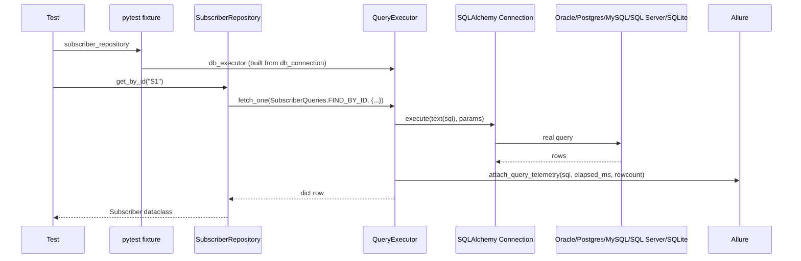

# Database Framework

`framework/database/` — the enterprise database validation layer added in
this milestone. Supports Oracle, PostgreSQL, MySQL, SQL Server, and SQLite
through one dialect-agnostic code path; which one a test actually talks to
is a configuration value, never a code change (see
[DatabaseConfiguration.md](DatabaseConfiguration.md)).

## Layer map

```
framework/database/
├── connection/     ConnectionFactory, ConnectionPoolManager, DatabaseManager
├── drivers/        dialect_registry — DbDialect -> SQLAlchemy drivername/port/pip-package
├── queries/        raw SQL, organized by business domain — the ONLY place SQL text lives
├── models/         frozen dataclasses — one per domain, column names == field names
├── repositories/   BaseRepository + 7 domain repositories (Repository pattern)
├── services/       UnitOfWork, SeedManager
├── validators/     DatabaseValidator + 6 domain validators (DB vs Expected/API/UI)
├── utilities/      QueryExecutor, TransactionManager, ResultMapper, DataComparator,
│                   SchemaManager, CleanupManager, CredentialResolver (secrets)
├── fixtures/       pytest fixtures wiring all of the above per test
├── telemetry/      Allure attachment helpers (SQL, timing, rows, comparison results)
├── audit/          AuditLogger — structured loguru logging of DB activity
├── exceptions/     DB-specific exception hierarchy (extends framework.exceptions)
├── constants/       DialectDriverInfo table, pool/timeout defaults
└── enums/           DbDialect, TransactionMode, IsolationLevel
```

## Request flow (a repository call, end to end)



## DatabaseManager — the entry point

One `DatabaseManager` per test session, holding one `Engine` per `db_key`
(a name in `settings.database`, e.g. `"subscriber_db"`), created **lazily**
on first use and cached for the session:

```python
def test_x(database_manager, db_key):
    assert database_manager.health_check(db_key)
    with database_manager.connection(db_key) as conn:
        ...
```

`ConnectionFactory.create_engine()` is the layer underneath that actually
builds the SQLAlchemy `Engine` from a `DatabaseConfig` — it resolves the
dialect's driver (`framework.database.drivers.dialect_registry`), builds the
connection URL, and configures pooling. SQLite gets a `StaticPool` +
`check_same_thread=False` so an in-memory database survives across the
multiple `Connection` objects a test session opens against it; every other
dialect gets a real `QueuePool` sized from `DatabaseConfig.pool_size` /
`pool_max_overflow` / `pool_recycle_seconds`.

## QueryExecutor — where every statement passes through

Repositories never call `Connection.execute()` directly — they go through
`QueryExecutor`, which:

1. Times execution (`ExecutionResult.elapsed_ms`)
2. Maps rows via `ResultMapper.to_dicts()`
3. Logs to `logs/execution.log` via `AuditLogger` (and flags slow queries
   past `DbDefaults.SLOW_QUERY_THRESHOLD_MS`)
4. Attaches SQL + timing + row count to the Allure report
   (`framework.database.telemetry.attach_query_telemetry`)
5. Translates `SQLAlchemyError` into `DatabaseQueryError` with the failing
   SQL and params in the message

## TransactionManager — commit / rollback / read-only / nested

```python
tx = TransactionManager(connection, db_key="subscriber_db")

with tx.transaction():                                    # commits on success
    ...

with tx.transaction(mode=TransactionMode.ROLLBACK):        # always discarded
    ...

with tx.transaction():
    with tx.nested_transaction():                          # SAVEPOINT
        ...                                                 # can fail without
                                                              # aborting the outer tx
```

## Repository pattern + Unit of Work

See [RepositoryPattern.md](RepositoryPattern.md) for the full contract. In
short: `queries/*.py` holds SQL, `repositories/*.py` holds
row<->model mapping and domain-specific finder methods, and `UnitOfWork`
coordinates several repositories under one transaction:

```python
with UnitOfWork(database_manager, "subscriber_db") as uow:
    subscribers = uow.repository(SubscriberRepository)
    audit = uow.repository(AuditRepository)
    subscribers.update_status(subscriber_id, "SUSPENDED", updated_at=now)
    audit.record(AuditLogEntry(...))
# both commit together, or both roll back together
```

## Demo schema

Seven domain tables (`tenants`, `networks`, `subscribers`, `steering_zones`,
`audit_log`, `alarms`, `system_config`) — a representative, illustrative
schema (Tenant, Network, Zone, Class of Service, audit trail) chosen to
exercise every layer of the database framework end to end. **This is a
demo schema for proving framework capability — not any specific customer's
real database schema.** Swapping in the real schema is a `queries/*.py` + `models/*.py`
column-mapping exercise once it's confirmed; nothing above the queries
layer needs to change.

Every `CREATE TABLE` uses `VARCHAR` primary keys (never
`SERIAL`/`IDENTITY`/autoincrement) and string-encoded ISO-8601 timestamps —
the two things that genuinely differ across SQLite/PostgreSQL/MySQL/
Oracle/SQL Server DDL. `SchemaManager`/`CleanupManager` create, drop, and
truncate all seven tables together; `SeedManager` populates a small
baseline dataset (see [DatabaseBestPractices.md](DatabaseBestPractices.md)
for why this matters more than it sounds).

## Validation & comparison

`DataComparator` does field-by-field, case/whitespace-insensitive
comparison between any two dict-like payloads and produces a
human-readable diff (`ComparisonResult.to_report()`). The 6 domain
validators (`SubscriberValidator`, `TenantValidator`, `NetworkValidator`,
`SteeringValidator`, `AlarmValidator`, `AuditValidator`) build on it to
compare one expected record against the database, an API payload, and/or a
UI-read value — see [HybridValidation.md](HybridValidation.md).

## Verified against

This milestone's full `tests/database` suite (71 tests) passes unmodified
against SQLite (default, zero setup), and was additionally run — same test
code, only `AUTOMATION_DB_DIALECT`/`AUTOMATION_DB_HOST`/... env vars changed — against
real PostgreSQL 16 and MySQL 8.4 containers via `docker-compose.yml`. Oracle
and SQL Server are supported by the same `ConnectionFactory`/dialect
registry code path and covered by dialect-mapping unit tests, but were not
verified against a live server in this environment (no Oracle/SQL Server
license/container available) — see
[DatabaseConfiguration.md](DatabaseConfiguration.md#oracle--sql-server) for
what's needed to close that gap.
