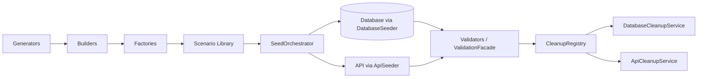

# Test Data Management Framework

`framework/testdata/` — a reusable Test Data Management (TDM) platform for
creating, managing, cleaning, versioning, and validating test data across
UI, API, and Database automation. The goal: **no automated test should
contain hardcoded business data** — every value comes from a builder,
factory, scenario, or dataset instead.

## Layer map

```
framework/testdata/
├── generators/    Random (RandomData extension), telecom identifiers (IMEI/
│                  IMSI/ICCID/MSISDN, Luhn-valid), deterministic seeding,
│                  custom generator registry
├── builders/      Fluent Builder pattern — 8 domain builders + BaseBuilder
├── factories/     Canned Factory-Method instances built on the builders
├── scenarios/     Scenario Library — 10 named, reusable business scenarios
├── datasets/      JSON/YAML/CSV/Excel dataset loading — versioned, shared,
│                  scenario-file conventions
├── providers/     Uniform DataProvider interface — DB/API/JSON/CSV/Excel/env
├── validators/    Schema, format, business-rule, uniqueness, relationship
├── masking/       PII masking/redaction + encryption (Fernet, reused)
├── synthetic/     Bulk synthetic generation + anonymization
├── importers/     Arbitrary-path CSV/JSON/Excel import (outside data/testdata/)
├── exporters/     CSV/JSON/Excel export
├── cache/         In-memory, TTL-aware cache for loaded/generated data
├── seed/          DatabaseSeeder, ApiSeeder, SeedOrchestrator
├── cleanup/       CleanupRegistry, DatabaseCleanupService, ApiCleanupService,
│                  UiCleanupHooks, RollbackManager
└── fixtures/      pytest fixtures wiring all of the above into tests
```

## Design principle: build on what already exists

This layer **extends**, not duplicates, the framework's existing pieces:

| Reused as-is | From |
|---|---|
| `RandomData` (names/emails/phones/UUIDs — extended additively with address/date methods) | `framework.utilities.random_data` |
| `TestDataLoader` (JSON/CSV/Excel) | `framework.utilities.test_data_loader` — `DatasetLoader` wraps it and adds YAML/versioning/shared/scenario conventions |
| `Tenant`/`Network`/`Subscriber`/`SteeringZone`/`Alarm` dataclasses | `framework.database.models` — builders produce these directly, not parallel copies |
| Repository layer, `UnitOfWork` | `framework.database.repositories`/`services` — `DatabaseSeeder`/`DatabaseCleanupService` are built on them |
| `ApiClient` | `framework.api.client` — `ApiSeeder`/`ApiCleanupService` reuse it (retry/logging/Allure included) |
| `CredentialResolver`'s Fernet encrypt/decrypt | `framework.database.utilities.secrets` — `TestDataEncryption` wraps it |
| `ValidationFacade` | `framework.hybrid` — the hybrid TDM flow (see below) is driven by it unmodified |

Only entities with no existing dataclass (`UserProfile`, `SimCard`,
`BillingRecord`) got new ones, in `framework/testdata/builders/models.py`.

## The core flow



A test typically enters this chain at one of three points:

1. **A single record**: `SubscriberFactory.active()` — for a test that just
   needs "a subscriber", not a whole scenario.
2. **A full scenario**: `seeded_scenario("roaming_subscriber")` (pytest
   fixture) — builds, seeds, and registers cleanup for every entity in the
   named scenario in one call.
3. **A file dataset**: `DatasetLoader.load_json(...)` /
   `load_dataset` fixture — for QA-authored or environment-specific data
   that doesn't belong in test code as builder calls.

## Verified against

`tests/testdata/` — 131 tests (115 unit, 16 integration) covering every
package above, including seed/cleanup round trips against a real SQLite
database and a real API seed call against dummyjson.com. The hybrid flow
(`tests/testdata/integration/test_hybrid_tdm_flow.py`) proves TDM-sourced
data flows through a real UI action, a real API call, and a real DB
validation — parametrized across all four `ValidationMode` values with an
**identical test body** — exactly the "consume test data -> validate ->
cleanup, without modifying test logic" requirement this milestone set out
to prove.

## Full document set

- [BuilderPattern.md](BuilderPattern.md) — the 8 builders, fluent API design
- [ScenarioLibrary.md](ScenarioLibrary.md) — the 10 named scenarios
- [DatasetManagement.md](DatasetManagement.md) — datasets/providers/importers/exporters/cache
- [SyntheticData.md](SyntheticData.md) — generators/masking/synthetic/anonymization
- [CleanupStrategy.md](CleanupStrategy.md) — cleanup/rollback design
- [BestPractices.md](BestPractices.md) — how to use this layer well
