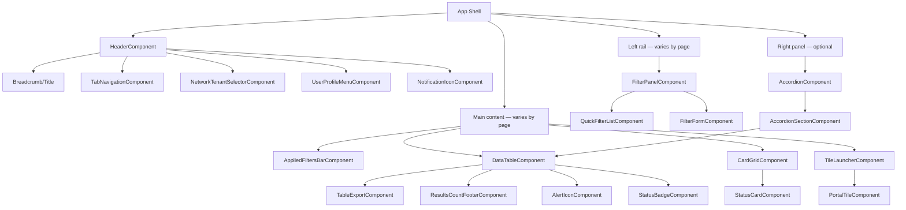

# UI Architecture

How the observed screens are put together, and how that maps onto this
framework's Page Object / Component Object model
(`docs/Architecture.md#ui-automation-architecture-milestone-3`).

## App shell (present on every captured screen)

```
┌──────────────────────────────────────────────────────────────────┐
│ Header: [Branding/Logo] [Breadcrumb title]   [Tabs, if any]       │
│                    [Network/Tenant selector ▾] [Avatar] [🔔] [📄] │
│                    [❓] [☰]                                        │
├──────────┬───────────────────────────────────────────┬───────────┤
│ Left     │ Main content                               │ Right     │
│ rail /   │  (varies by page — list+filter, card grid, │ panel     │
│ sidebar  │   or module launcher grid)                 │ (optional,│
│ (varies) │                                             │ collapsible│
│          │                                             │ accordion)│
└──────────┴───────────────────────────────────────────┴───────────┘
```

Two concrete instances of this shell were captured:

1. **Portal shell**: thin icon-only left rail (search + expand), no tabs in
   the header, module-launcher grid as main content, activity accordion as
   the right panel.
2. **Data-module shell**: full Filters sidebar (quick filters + detail
   filter form) as the left rail, tab bar in the header, data table as
   main content, no right panel.

The shell is consistent enough (same header chrome: avatar, bell, doc, help,
hamburger, in the same order, both times) to justify a single
`HeaderComponent` reused across every module, exactly as
`framework/components/header_component.py` already models — confirms that
Milestone 3's generic 14-component set was the right level of abstraction,
not a guess to revisit.

## Layout patterns identified

### Pattern 1 — "List + Filter" (Steering overview)

Sidebar filter panel (quick-select list + multi-field form) drives a main
data table. This is the single most automation-relevant pattern in the app —
almost every operational screen in a telecom ops platform follows it
(alarm lists, subscriber lists, CDR search, etc.), so the component built for
it here should be treated as the template for every future module, not a
one-off.

### Pattern 2 — "Card status grid" (Tenants)

A grid of uniform cards, each with an icon-driven status (red
triangle = attention, green check = healthy) and a label. Same shape as a
dashboard-widget grid. Reusable as one `CardGridComponent` +
`StatusCardComponent` pair rather than a bespoke Tenants-only component.

### Pattern 3 — "Tile launcher" (Portal)

A grid of large icon+label tiles grouped under section headers, each tile
navigating to a module. Structurally identical to Pattern 2 (a grid of
uniform cards) but tiles carry no status indicator and act as navigation,
not data display — worth a distinct `TileLauncherComponent` because its
interaction contract (click = navigate) differs from a status card's
(click = presumably select/switch context).

### Pattern 4 — "Collapsible accordion panel" (portal right panel)

Three named, independently-expandable sections (Recent activity /
Application logs / Failed login attempts). Generic enough to be its own
`AccordionComponent` wrapping N `AccordionSectionComponent` children.

## Component relationship diagram



This is a **superset** of the 14 components Milestone 3 already built
generically (Header, Sidebar/FilterPanel-equivalent, Table, Pagination,
Grid, Modal, ConfirmationDialog, Notification, SearchBox, DatePicker,
Dropdown, TreeView, Breadcrumb, TopNavigation) — every net-new component this
document names (`TileLauncherComponent`, `AccordionComponent`,
`StatusCardComponent`, `AlertIconComponent`, `StatusBadgeComponent`,
`AppliedFiltersBarComponent`) is additive, not a redesign. See
[ReusableComponents.md](ReusableComponents.md) for the full catalog with
priority.

## Notable UI details worth flagging early

- **Chips carry compound state**: the applied-filter chip read
  `Home network + A01_Network_N1 (101-01)` as one chip, not two — a
  `FilterChip` component needs to handle multi-part labels, not assume
  "one filter = one chip".
- **Quick-filter selection is single-select with a filled/dark background**,
  not a checkbox list — `is_active()`-style state reads should key off a
  CSS class or `aria-selected`, not a checkbox `checked` property.
- **The table's "Needs attention" column is icon-only**, no text — an
  accessible name (`aria-label`) is the only reliable way to assert its
  state without relying on colour.
